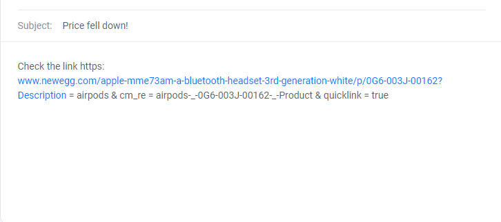

# **PRICE TRACKER**

## **What Is This?**

This is a simple price tracker app using python that regularly compares the prices of your favorite stuff on amazon and sends you a customized notification email to tell you if the prices fell down. This uses python and implements beautiful soup, smtplib, time and requests modules and libraries.

---

<p>&nbsp;</p>

### **How to use**

<mark style="background-color:lightblue">open the scraper.py file in IDE and run the file</mark>

---

<p>&nbsp;</p>

## **Installing libraries and packages**

To install Requests, bs4, schedule simply run this simple command in your terminal of choice:

> pip install requests bs4 schedule

---
<p>&nbsp;</p>


 #### The libraries, modules and other tools referred during this task are as follows: <br><br>
 
 ##### The smtplib module defines an SMTP client session object that can be used to send mail to any internet machine with an SMTP or ESMTP listener daemon - <u>[smtplib](https://docs.python.org/3/library/smtplib.html) </u>
 <br>


##### The requests library is the de facto standard for making HTTP requests in Python - <u>[requests](https://docs.python-requests.org/en/latest/) </u> 
<br>

##### Beautiful Soup is a Python library for pulling data out of HTML and XML files. It works with your favorite parser to provide idiomatic ways of navigating, searching, and modifying the parse tree - <u>[bs4](https://www.crummy.com/software/BeautifulSoup/bs4/doc/)</u> 
<br>


##### The Python time module provides many ways of representing time in code, such as objects, numbers, and strings - <u>[time](https://docs.python.org/3/library/time.html)</u> 
<br>


##### Schedule lets you run Python functions (or any other callable) periodically at pre-determined intervals using a simple, human-friendly syntax - <u>[schedule](https://schedule.readthedocs.io/en/stable/)</u>

<p>&nbsp;</p>

```python
import smtplib
import requests
from bs4 import BeautifulSoup
import time
import schedule
```

<p>&nbsp;</p>

In the function below, we use the request and beautifulSoup modules to scrape information from html (in this case, the title and price of the product), and to verify that the price has changed as specified by the user.

Beautiful Soup has a built-in method that allows you to search for HTML tags by class name. As of Beautiful Soup 4.1.2, you can search by tag's class using the keyword argument class_ like so. Because class is a reserved keyword used internally by Python itself, you have to use class_ argument instead.

the Parameters on line 26 convert the string into float

```python
# function to check if the price has dropped
def check_price():

    page = requests.get(URL, headers=headers)
    soup = BeautifulSoup(page.content, 'html.parser')

# using BS to pull out product name and price from html
    title = soup.find(class_="product-title").get_text()
    price = soup.find(class_="price-current").get_text()
    conv_price = float(price[1:4])
```
<p>&nbsp;</p>

if statement that execute send_mail function if the specified price is less than current price:

the program will send user the email since the specified price is below the current price of the prodcut.the price can be change accordingly to the user need
```python
# if statement that send mail if the price goes below
    if(conv_price < 171):
        send_mail()
```

<p>&nbsp;</p>

The smtplib is a Python library for sending emails using the Simple Mail Transfer Protocol (SMTP). The smtplib is a built-in module; we do not need to install it. It abstracts away all the complexities of SMTP.

1. Set up a Gmail account for sending your emails. Since you’ll be feeding a plaintext password to the program, Google considers the SMTP connection less secure.

2. Go to the account settings and allow less secure apps to access the account. As an aside, Gmail doesn't necessarily use SMTP on their internal mail servers; however, Gmail SMTP is an interface enabled by Google's smtp.gmail.com server.

3.  Import smtplib. Since Python comes pre-packaged with smtplib, all you have to do is create a Python file and import smtplib into it.

4. To create a secure connection use SMTP with 587 port.

```python
# function that sends an email if the prices fell down
def send_mail():
    server = smtplib.SMTP('smtp.gmail.com', 587)
    server.ehlo()
    server.starttls()
    server.ehlo()
    server.login('pricetrack2022@gmail.com', 'bxaelgyfhvknajnp')

    subject = 'Price fell down!'
    body = "Check the link https: \n www.newegg.com/apple-mme73am-a-bluetooth-headset-3rd-generation-white/p/0G6-003J-00162?Description = airpods & cm_re = airpods-_-0G6-003J-00162-_-Product & quicklink = true"
    msg = f"Subject: {subject}\n\n{body}"

    server.sendmail(
        'pricetrack2022@gmail.com',  # sender Email
        'momip68712@sofrge.com',  # Receiver Email
        msg
    )

    print('Email has been sent')

    server.quit()
```

<p>&nbsp;</p>

We can use the Schedule module to create a Python script that will be executed at specific time intervals. with this while loop that runs the script every three hours. 


```python
# loop that allows the program to regularly check for prices (3 hr)
while(True):
    check_price()
    schedule.run_pending()
    time.sleep(10800)
```
##### (to stop the script press ctrl + c)
---

<p>&nbsp;</p>

## Sample Test Run

```
Apple AirPods 3rd Generation  - White MME73AM/A
Current Price $ 169.0
hurray!!! price has went down
 Email has been sent
```



<p>&nbsp;</p><p>&nbsp;</p>

---

## Future idea

Web scraping is a technique used to extract large amount of data from websites and store it in your computer . This data can be later used for analysis.

Sentiment analysis can be performed over the reviews scraped from products on websitesSuch a study helps in identifying the user’s emotion towards a particular product. This can help sellers or even other prospective buyers in understanding the public sentiment related to the product.

With libraries like Beautiful Soup and Request it is possible to scrape any product available on Amazon or other websites and analyze its customers' reviews. After scraping, it is possible to do sentiment analysis and perform statistical analyses to draw valuable conclusions.
